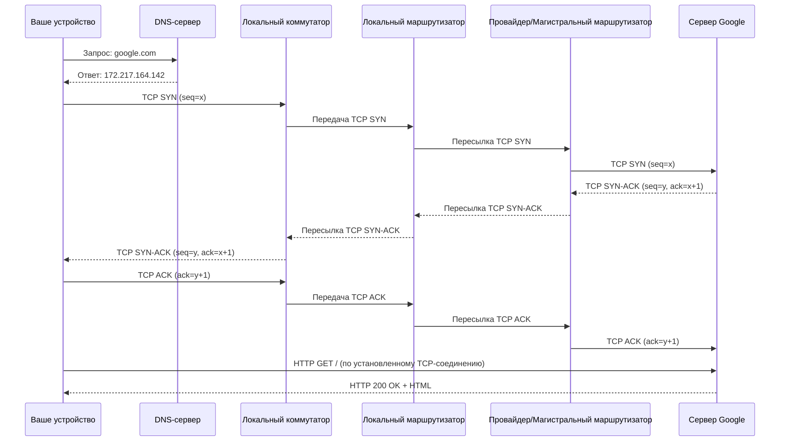

# Лекция: Эволюция веб-технологий – от зарождения интернета до HTTP/2 и REST

**Общая длительность:** примерно 80 минут

---

## 0. Введение (8–10 минут)

### 0.1 Приветствие и постановка целей
- Приветствие слушателей.
- Объяснение важности понимания истории и технических основ, лежащих в основе современного Интернета и веб-сервисов.

### 0.2 Краткий обзор тем лекции
- Как появился интернет: от исследований до ARPANET.
- Основы компьютерных сетей: виды, компоненты и принципы передачи данных.
- DNS: роль системы доменных имён.
- OSI-модель: семислойная схема передачи данных.
- TCP: обеспечение надёжной доставки данных.
- Эволюция HTTP: от первых версий до современных.
- Сравнение HTTP/1.x и HTTP/2: архитектурные отличия и преимущества нового протокола.
- Обзор REST: архитектурный стиль для разработки API.

### 0.3 Цель лекции
- Понять, как исторически и технически формировались протоколы и модели, используемые в распределённых системах, и какие задачи они решали.

---

## 1. Как появился интернет (примерно 10 минут)

### 1.1 Истоки и мотивация
- **Холодная война и военные исследования:**
  - В 1960-х годах США искали способы обеспечить устойчивую связь даже при ядерном ударе.
  - Результатом стали исследования, приведшие к созданию **ARPANET** – первой пакетной сети.
- **Академические и исследовательские проекты:**
  - Университеты и исследовательские институты объединились для обмена информацией.
  - Стимулировали разработку новых протоколов и технологий для распределения вычислительных ресурсов и данных.

### 1.2 Основные этапы развития интернета
- **ARPANET (конец 1960-х – 1970-е):**
  - Первая успешная реализация пакетной передачи данных.
  - **Исторический факт:**  
    - В 1969 году ARPANET состоял из **4 узлов** (UCLA, UCSB, SRI и Университета Юты).  
    - К 1972 году сеть расширилась до **23 узлов**.
  - Зарождение концепций маршрутизации и распределённой обработки.
- **Переход к TCP/IP (начало 1980-х):**
  - Протоколы TCP и IP стали стандартом, позволив взаимодействовать между различными сетями.
  - Создание единого глобального Интернета.
- **Коммерциализация и рост сети (1990-е):**
  - С появлением Всемирной паутины (World Wide Web) Интернет стал доступен широкой аудитории.
  - Возникла необходимость в развитии протоколов для эффективной работы с огромными объёмами данных.

---

## 2. Сети (примерно 10 минут)

### 2.1 Определение компьютерной сети
- **Компьютерная сеть** – совокупность взаимосвязанных устройств (компьютеров, серверов, маршрутизаторов, коммутаторов и др.), обменивающихся информацией по установленным протоколам.
- **Ключевые аспекты:**
  - **Обмен информацией:** передача данных, файлов, сообщений, мультимедийного контента и т.д.
  - **Взаимосвязь устройств:** объединение как домашних компьютеров, так и крупных дата-центров.
  - **Протоколы связи:** например, TCP/IP, обеспечивающие совместимость и стандартизацию.

### 2.2 Виды сетей

#### 2.2.1 LAN (Local Area Network)
- **Определение:** Локальная сеть, охватывающая небольшую территорию (дом, офис, здание).
- **Характеристики:**
  - Высокая скорость передачи данных (Ethernet, Wi-Fi).
  - Низкая задержка из-за минимальных расстояний.
  - Ограниченное географическое покрытие.
- **Примеры:** Домашние сети, корпоративные офисы, университетские кампусы.

#### 2.2.2 WAN (Wide Area Network)
- **Определение:** Сеть, охватывающая большие географические расстояния, вплоть до глобального масштаба.
- **Характеристики:**
  - Большое покрытие (соединяет устройства в разных городах, странах, континентах).
  - Более низкая скорость по сравнению с LAN (из-за сложностей передачи на большие расстояния).
  - Сложное управление (маршрутизация, безопасность).
- **Примеры:** Интернет, корпоративные сети, объединяющие офисы в разных регионах.

#### 2.2.3 MAN (Metropolitan Area Network)
- **Определение:** Сеть, охватывающая территорию одного города или муниципального района.
- **Характеристики:**
  - Покрытие между LAN и WAN.
  - Высокая скорость передачи данных в пределах города.
- **Примеры:** Городские сети, подключающие образовательные учреждения, государственные и коммерческие организации.

### 2.3 Основные компоненты сети

#### 2.3.1 Клиенты и серверы
- **Клиенты:** Устройства (компьютеры, смартфоны, планшеты), с которых инициируются запросы.
- **Серверы:** Специализированные компьютеры, обрабатывающие запросы, хранящие файлы, обеспечивающие работу веб-сайтов и баз данных.
- **Пример:** Браузер (клиент) отправляет HTTP-запрос на веб-сервер, который возвращает страницу.

#### 2.3.2 Маршрутизаторы и коммутаторы
- **Маршрутизаторы:**
  - Работают на сетевом уровне (уровень 3 по OSI).
  - Принимают решения о маршрутизации на основе IP-адресов.
  - Определяют оптимальный маршрут, используя таблицы маршрутизации и протоколы (например, OSPF, BGP).
- **Коммутаторы:**
  - Работают на канальном уровне (уровень 2 по OSI).
  - Передают данные внутри одной локальной сети, используя MAC-адреса для определения порта назначения.
- **Отличия:**
  - **Маршрутизатор** выполняет маршрутизацию между различными сетями (например, LAN ↔ WAN).
  - **Коммутатор** работает внутри одной локальной сети, обеспечивая связь между отдельными устройствами.
- **DNS и его отношение к маршрутизаторам и коммутаторам:**
  - **DNS** (Domain Name System) работает на прикладном уровне и занимается разрешением доменных имён в IP-адреса.
  - Хотя DNS не выполняет маршрутизацию, его результаты (IP-адреса) используются маршрутизаторами для выбора оптимального пути передачи данных.
  - Коммутаторы обеспечивают передачу кадров внутри локальной сети, опираясь на MAC-адреса, а DNS помогает устройствам «найти» нужный IP-адрес для дальнейшей маршрутизации.

#### 2.3.3 Физические носители
- **Кабели:** Витая пара, коаксиальные кабели – для проводной передачи данных.
- **Оптоволокно:** Передача данных с использованием света, обеспечивает высокую скорость.
- **Беспроводные соединения:** Wi-Fi, Bluetooth, LTE – для мобильных устройств или когда кабельное подключение невозможно.

### 2.4 Принципы передачи данных

#### 2.4.1 Пакетная передача данных
- **Описание:** Данные разбиваются на небольшие блоки (пакеты), каждый из которых содержит:
  - **Данные:** Фрагмент исходной информации.
  - **Заголовок:** Служебная информация (адреса отправителя и получателя, номера последовательности, контроль ошибок).
- **Преимущества:**
  - **Надёжность:** Повторная передача только потерянных пакетов.
  - **Эффективность:** Оптимальные маршруты и равномерная загрузка сети.
  - **Гибкость:** Совместная передача различных типов данных (текст, видео, аудио).
- **Пример:** Отправка большого файла по электронной почте – файл делится на несколько пакетов, и при потере пересылается только недостающий фрагмент.

#### 2.4.2 Маршрутизация данных
- **Определение маршрута:**  
  Маршрутизатор анализирует таблицы маршрутизации и выбирает оптимальный путь для пакета.
- **Протоколы маршрутизации:**
  - **OSPF (Open Shortest Path First):** Вычисляет кратчайший путь с учётом нагрузки.
  - **BGP (Border Gateway Protocol):** Используется для обмена маршрутной информацией между автономными системами в Интернете.
- **Динамическое обновление:**  
  Обновление маршрутов в режиме реального времени для адаптации к изменениям в сети.
- **Избыточность и отказоустойчивость:**  
  При отказе одного маршрута пакет перенаправляется через альтернативный путь.
- **Пример:** Если один маршрутизатор перегружен или вышел из строя, пакет данных перенаправляется через другой, обеспечивая доставку сообщения.

---

## 3. DNS (Domain Name System) (примерно 10 минут)

### 3.1 Назначение DNS
- **DNS** – система, предназначенная для преобразования удобных для человека доменных имён в числовые IP-адреса.
- **Ключевая идея:** Доменные имена как имена людей, а IP-адреса – как их телефонные номера.

### 3.2 Структура системы DNS
- **Корневые серверы:**  
  Самые верхние в иерархии, перенаправляют запросы к серверам доменов верхнего уровня.
- **Серверы верхнего уровня (TLD):**  
  Отвечают за домены (например, .com, .ru, .net) и содержат информацию об авторитетных серверах для соответствующих доменных зон.
- **Авторитетные серверы:**  
  Хранят окончательные записи доменных имён, возвращая точный IP-адрес по запросу.

### 3.3 Пример работы DNS
- **Ввод адреса:**  
  Пользователь вводит, например, `google.com` в браузере.
- **Обращение к локальному DNS-серверу:**  
  Сначала запрос направляется к DNS-серверу, предоставленному провайдером или настроенному в локальной сети.
- **Проверка кэша:**  
  Если запись уже сохранена – немедленный ответ.
- **Рекурсивный запрос:**  
  При отсутствии записи локальный сервер обращается к корневым серверам, затем к TLD-серверу и, наконец, к авторитетному серверу.
- **Получение IP-адреса:**  
  Авторитетный сервер возвращает IP, который передаётся обратно клиенту.
- **Установление соединения:**  
  Браузер, получив IP, устанавливает соединение с нужным сервером и запрашивает страницу.

### 3.4 Значение DNS
- Обеспечивает масштабируемость и отказоустойчивость благодаря иерархической структуре.
- Позволяет пользователям работать с понятными именами вместо сложных числовых адресов.

---

## 4. OSI-модель (примерно 10 минут)

### 4.1 Введение в OSI-модель
- **OSI (Open Systems Interconnection)** – семислойная модель, упрощающая понимание процессов передачи данных в сети.
- **Пример несовпадения с OSI-моделью:**
  - Протоколы TCP/IP имеют 4 уровня, а не 7, как в OSI.
  - Некоторые протоколы, например, **ARP (Address Resolution Protocol)**, не укладываются чётко в рамки OSI, поскольку ARP работает для преобразования IP-адресов в MAC-адреса и фактически функционирует между канальным и сетевым уровнем.

### 4.2 Слои OSI-модели и их функции
1. **Физический уровень:** Передача сырых битов по физическим носителям (кабели, оптоволокно).
2. **Канальный уровень:** Формирование кадров, обнаружение и коррекция ошибок.
3. **Сетевой уровень:** Маршрутизация пакетов (например, с использованием IP).
4. **Транспортный уровень:** Обеспечение надёжной доставки данных (TCP, UDP).
5. **Сеансовый уровень:** Установление, управление и завершение сеансов связи.
6. **Уровень представления:** Преобразование, шифрование, сжатие данных.
7. **Прикладной уровень:** Сервисы и приложения (HTTP, FTP, SMTP).

### 4.3 Сравнение с моделью TCP/IP
- В реальных сетях многие протоколы (например, TCP/IP) не строго соответствуют OSI, но модель остаётся полезной для понимания комплексности сетевых систем.

---

## 5. Основы работы TCP (примерно 10 минут)

### 5.1 Назначение TCP
- **TCP (Transmission Control Protocol)** обеспечивает надёжную, последовательную и проверенную доставку данных между устройствами.

### 5.2 Механизм установления соединения: трёхстороннее рукопожатие
- **SYN:**  
  Клиент отправляет запрос на установление соединения с начальным номером последовательности.
- **SYN-ACK:**  
  Сервер отвечает, подтверждая запрос и отправляя свой начальный номер.
- **ACK:**  
  Клиент подтверждает получение данных сервера, после чего соединение считается установленным.

### 5.3 Контроль доставки данных в TCP
- **Номера последовательности и подтверждения (ACK):**
  - Каждое отправленное сообщение получает порядковый номер.
  - Получатель отправляет ACK, подтверждая получение.
- **Контрольные суммы:**  
  Позволяют обнаружить повреждения данных.
- **Таймауты и повторные передачи:**  
  Если подтверждение не получено, пакет пересылается повторно.

### 5.4 Структура TCP-пакета
- **TCP-заголовок** содержит следующие поля:
  - **Source Port:** Порт отправителя.
  - **Destination Port:** Порт получателя.
  - **Sequence Number:** Номер последовательности, определяющий порядок пакетов.
  - **Acknowledgment Number:** Подтверждение получения данных.
  - **Data Offset:** Размер заголовка.
  - **Reserved:** Зарезервированные биты.
  - **Flags:** Управляющие флаги (SYN, ACK, FIN, RST, PSH, URG и др.).
  - **Window Size:** Размер окна, определяющий количество байт, которые можно отправить без подтверждения.
  - **Checksum:** Контрольная сумма для проверки целостности.
  - **Urgent Pointer:** Указывает на срочные данные.
  - **Options (если есть):** Дополнительные параметры (например, масштабирование окна).

### 5.5 Визуальное представление процесса
- Использование схем или диаграмм для иллюстрации процесса трёхстороннего рукопожатия и контроля доставки данных.

  
Client                         Server
  |                              |
  | --- SYN (seq = x) ---------->|
  |                              |
  |<-- SYN-ACK (seq = y, ack=x+1)-|
  |                              |
  | --- ACK (ack = y+1) -------->|
  |                              |
       TCP-соединение установлено

---

## 6. Рождение и развитие HTTP (примерно 10 минут)

### 6.1 Рождение HTTP
- **HTTP/0.9:**
  - Первая версия протокола.
  - Поддерживался только метод GET.
  - Отсутствие заголовков – ограниченная функциональность.

### 6.2 Развитие протокола
- **HTTP/1.0:**
  - Введение заголовков, появление методов POST и HEAD.
  - Каждый запрос требовал нового соединения, что приводило к задержкам.
- **HTTP/1.1:**
  - Стандартизация протокола.
  - **Поддержка Keep-Alive:**  
    Позволяет использовать одно TCP-соединение для множества запросов, уменьшая накладные расходы на установление соединений и ускоряя передачу данных.
  - Улучшенное кэширование и расширенные возможности аутентификации.

### 6.3 Проблемы и вызовы первых версий HTTP
- **Последовательность запросов:**
  - Последовательное выполнение запросов приводило к задержкам.
  - Проблема «головной линии блокировки» (Head-of-Line Blocking): один медленный запрос мог задерживать последующие.
- **Избыточность заголовков:**
  - Текстовый формат заголовков приводил к дополнительным накладным расходам и увеличивал объём передаваемых данных.

### 6.4 Структура HTTP-запроса
- **Стандартная структура HTTP-запроса:**
  - **Request Line:**  
    Пример:  
    ```
    GET /index.html HTTP/1.1
    ```
  - **Заголовки (Headers):**  
    Пример:
    ```
    Host: www.example.com
    User-Agent: Mozilla/5.0 (Windows NT 10.0; Win64; x64)
    Accept: text/html,application/xhtml+xml,application/xml;q=0.9,*/*;q=0.8
    ```
  - **Пустая строка:**  
    Разделитель между заголовками и телом.
  - **Тело запроса (опционально):**  
    Данные, передаваемые методом POST, PUT и др.

---

## 7. Сравнение HTTP/1.x и HTTP/2 (примерно 10 минут)

### 7.1 Архитектурные отличия
- **HTTP/1.x:**
  - Текстовый протокол.
  - Каждый запрос требует отдельного соединения или последовательной обработки в одном соединении.
  - Проблема «головной линии блокировки»: задержка одного запроса влияет на остальные.
  - Избыточность заголовков в текстовом формате.
- **HTTP/2:**
  - Двоичный протокол, позволяющий компактно представлять данные.
  - **Мультиплексирование запросов:**  
    Возможность одновременной обработки нескольких запросов по одному TCP-соединению.
  - **Сжатие заголовков:**  
    Снижение объёма передаваемой служебной информации.
  - **Server Push:**  
    Сервер может заранее отправлять клиенту ресурсы, которые, скорее всего, понадобятся для отображения страницы.

### 7.2 Преимущества HTTP/2
- Снижение задержек и увеличение производительности.
- Эффективное использование ресурсов за счёт уменьшения накладных расходов на установление соединений.

### 7.3 Пример из практики
- **HTTP/1.x:**  
  Браузер либо создаёт несколько соединений, либо ждёт завершения одного запроса за другим. Один медленный запрос может задержать загрузку всех остальных.
- **HTTP/2:**  
  Все ресурсы передаются по одному соединению с параллельной обработкой, что ускоряет отображение страницы.

### 7.4 Как работает Server Push
- **Механизм Server Push:**  
  Сервер, зная, что клиент запрашивает основную страницу, может «предугадывать» и заранее отправлять связанные ресурсы (например, CSS, JavaScript, изображения).
- Клиент получает push-пакеты, сохраняет их в кэше и использует при необходимости, что сокращает время ожидания запроса этих ресурсов.

---

## 8. Обзор REST (примерно 10 минут)

### 8.1 Что такое REST
- Архитектурный стиль для разработки API и распределённых систем.
- Использует стандартные методы HTTP (GET, POST, PUT, DELETE) для работы с ресурсами.

### 8.2 Основные принципы REST
- **Клиент-серверная архитектура:**  
  Разделение ответственности между клиентом и сервером.
- **Без состояния (stateless):**  
  Каждый запрос содержит всю необходимую информацию для обработки.
- **Кэширование:**  
  Возможность кэшировать ответы для повышения производительности.
- **Единообразие интерфейса:**  
  Стандартизированные методы взаимодействия.
- **Слои:**  
  Возможность применения промежуточных серверов (например, балансировщиков нагрузки).
- **(Опционально) Код по требованию:**  
  Сервер может отправлять клиентский код для выполнения.

### 8.3 Преимущества REST
- Простота, масштабируемость и гибкость интеграции с различными клиентами.
- Широкое применение в разработке современных веб-сервисов.

### 8.4 Примеры использования REST
- **RESTful API** в социальных сетях, облачных платформах и других современных веб-приложениях.

---

## 9. Заключение (7–8 минут)

### 9.1 Подведение итогов
1. **История появления интернета:**  
   - От ARPANET (с 4 узлами в 1969 году, до 23 узлов к 1972 году) до внедрения TCP/IP.
2. **Основы компьютерных сетей:**  
   - Виды: LAN, WAN, MAN.
   - Компоненты: клиенты, серверы, маршрутизаторы, коммутаторы, физические носители.
   - Принципы передачи данных: пакетная передача и маршрутизация.
3. **DNS:**  
   - Система преобразования доменных имён в IP-адреса и её иерархическая структура.
   - Роль в взаимодействии с маршрутизаторами (на сетевом уровне) и коммутаторами (на канальном уровне).
4. **OSI-модель:**  
   - Семислойная модель для понимания процессов передачи данных.
   - Пример несовпадения: ARP не укладывается в OSI, а протокол TCP/IP имеет 4 уровня.
5. **TCP:**  
   - Обеспечение надёжной доставки данных через трёхстороннее рукопожатие, контроль ошибок, повторную передачу.
   - Подробная структура TCP-пакета.
6. **Эволюция HTTP:**  
   - От HTTP/0.9 до HTTP/1.1 с поддержкой keep-alive, снижающего накладные расходы.
7. **Сравнение HTTP/1.x и HTTP/2:**  
   - Архитектурные отличия, преимущества мультиплексирования, сжатия заголовков и работы Server Push.
8. **REST:**  
   - Архитектурный стиль для разработки API, его принципы и преимущества.

---

Ниже приведён подробный сценарий прохождения TCP-запроса от вашего устройства до серверов Google и обратно, с учётом всех этапов (DNS-разрешение, маршрутизация, коммутаторы, маршрутизаторы, TCP-хэндшейк и передача данных):

---

### 1. DNS-Разрешение

1. **Ввод адреса:**  
   Вы вводите в браузере `google.com`.

2. **Проверка локального кэша:**  
   Браузер сначала проверяет, есть ли уже в кэше IP-адрес для `google.com`.

3. **Запрос к DNS-серверу:**  
   Если в кэше нет записи, запрос направляется на локальный DNS-сервер (обычно предоставленный вашим интернет-провайдером).

4. **Рекурсивный DNS-запрос:**  
   Локальный DNS-сервер, если не знает ответ, инициирует рекурсивный запрос – сначала к одному из корневых серверов, затем к серверу верхнего уровня (например, для домена .com), и, наконец, к авторитетному серверу Google.

5. **Получение IP-адреса:**  
   После получения ответа локальный сервер возвращает вашему устройству IP-адрес (например, `172.217.164.142`).

---

### 2. Установление TCP-соединения (TCP-хэндшейк)

1. **Подготовка запроса:**  
   После получения IP-адреса ваше устройство готовится установить TCP-соединение с сервером Google (обычно на порту 80 для HTTP или 443 для HTTPS).

2. **Маршрутизация запроса:**  
   Ваш запрос покидает устройство, проходя через:
   - **Локальный коммутатор:** Переключает кадры внутри вашей локальной сети.
   - **Локальный маршрутизатор:** Отправляет пакет дальше по сети вашего провайдера.
   - **Промежуточные сети и магистральные маршрутизаторы:** Пакет передаётся по различным маршрутам через интернет до сервера Google. На каждом узле (маршрутизаторе) происходит пересылка пакетов согласно таблицам маршрутизации.

3. **TCP-хэндшейк:**
   - **SYN:**  
     Ваше устройство отправляет TCP-пакет с флагом SYN и начальным номером последовательности (например, `seq=x`).
   - **Переход через сеть:**  
     Этот пакет проходит через коммутаторы и маршрутизаторы на пути к серверу Google.
   - **SYN-ACK:**  
     Сервер Google получает пакет, обрабатывает его и отправляет обратно пакет с флагами SYN и ACK (например, `seq=y, ack=x+1`).
   - **ACK:**  
     Ваше устройство получает SYN-ACK и отправляет финальный ACK (например, `ack=y+1`), после чего TCP-соединение устанавливается.

---

### 3. Передача данных (HTTP-запрос и ответ)

1. **Отправка HTTP-запроса:**  
   Теперь, когда TCP-соединение установлено, ваше устройство отправляет HTTP-запрос (например, `GET / HTTP/1.1`) через этот канал.  
   - HTTP-запрос формируется как текстовое сообщение, которое сериализуется в поток байтов и разбивается на TCP-сегменты.
   - Каждый сегмент передаётся с использованием того же пути (через коммутаторы и маршрутизаторы).

2. **Обработка на сервере:**  
   Сервер Google получает TCP-сегменты, собирает их в целое HTTP-сообщение, обрабатывает запрос и формирует HTTP-ответ (например, `HTTP/1.1 200 OK` с HTML-контентом).

3. **Передача HTTP-ответа:**  
   Ответ разбивается на TCP-сегменты и отправляется обратно по тому же пути:
   - Сервер формирует TCP-пакеты, которые проходят через сеть (маршрутизаторы, коммутаторы) до вашего устройства.
   - TCP на стороне клиента собирает сегменты, восстанавливает поток байтов, а HTTP-парсер разбирает полученное сообщение.

---

### 4. Завершение соединения (опционально)

- После завершения передачи данных может быть выполнена процедура завершения TCP-соединения (последовательность FIN/ACK), либо соединение остаётся открытым для последующих запросов (если используется Keep-Alive).

---

### Схематичное представление процесса



---

# Как реально летит TCP-запрос от меня в Google и назад

Ниже приведён подробный сценарий прохождения TCP-запроса от вашего устройства до серверов Google и обратно, с учётом всех этапов: DNS-разрешение, маршрутизация через коммутаторы и маршрутизаторы, установление TCP-соединения (TCP-хэндшейк) и передача данных.

---

## 1. DNS-разрешение

1. **Ввод адреса:**  
   Вы вводите в браузере `google.com`.

2. **Проверка локального кэша:**  
   Браузер сначала проверяет, есть ли в кэше IP-адрес для `google.com`.

3. **Запрос к DNS-серверу:**  
   Если записи нет, запрос отправляется на локальный DNS-сервер, предоставленный вашим интернет-провайдером.

4. **Рекурсивный DNS-запрос:**  
   Локальный DNS-сервер, если не имеет нужной записи, выполняет рекурсивный запрос:  
   - Сначала к одному из корневых серверов,  
   - Затем к серверу верхнего уровня (например, для домена .com),  
   - И, наконец, к авторитетному серверу Google.

5. **Получение IP-адреса:**  
   После получения ответа локальный DNS-сервер возвращает вашему устройству IP-адрес (например, `172.217.164.142`).

---

## 2. Установление TCP-соединения (TCP-хэндшейк)

1. **Подготовка запроса:**  
   После получения IP-адреса ваше устройство готовится установить TCP-соединение с сервером Google (обычно на порту 80 для HTTP или 443 для HTTPS).

2. **Маршрутизация запроса:**  
   Ваш запрос покидает устройство и проходит через:
   - **Локальный коммутатор:** Переключает кадры внутри вашей локальной сети.
   - **Локальный маршрутизатор:** Отправляет пакет дальше по сети.
   - **Промежуточные узлы:** Пакет передаётся через маршрутизаторы провайдера и магистральные маршрутизаторы до сервера Google.

3. **TCP-хэндшейк:**
   - **SYN:**  
     Ваше устройство отправляет TCP-пакет с флагом **SYN** и начальным номером последовательности (например, `seq = x`).
   - **Переход через сеть:**  
     Этот пакет проходит через коммутаторы и маршрутизаторы на пути к серверу Google.
   - **SYN-ACK:**  
     Сервер Google получает пакет, обрабатывает его и отправляет обратно TCP-пакет с флагами **SYN** и **ACK** (например, `seq = y, ack = x+1`).
   - **ACK:**  
     Ваше устройство получает SYN-ACK и отправляет финальный **ACK** (например, `ack = y+1`), после чего TCP-соединение устанавливается.

---

## 3. Передача данных (HTTP-запрос и ответ)

1. **Отправка HTTP-запроса:**  
   После установления TCP-соеди


